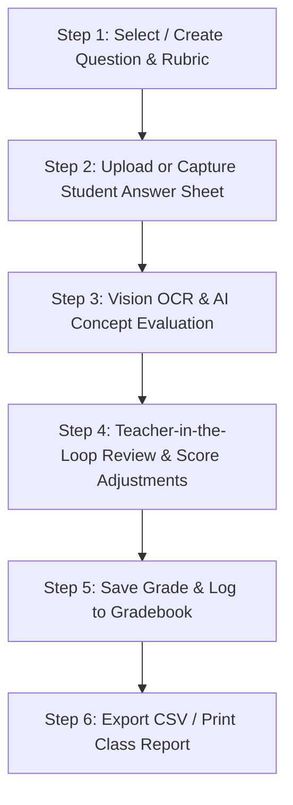

# 🦅 GradeCrow AI — Project Overview & Architecture Documentation

> **Live Application**: [https://gradecrow.vercel.app/](https://gradecrow.vercel.app/)  
> **Domain**: `gradecrow.com`  
> **Tagline**: *"Sharp eyes. Fair marks. Zero grading fatigue."*  
> **Primary Use Case**: Automated & semi-automated evaluation of handwritten exam papers using Multimodal AI Vision (Google Gemini) and teacher-in-the-loop validation.

---

## 📌 Executive Overview

**GradeCrow AI** is a high-performance, mobile-first web application designed for educators, teachers, and university professors across all disciplines (STEM, Medicine, Humanities, Social Sciences, etc.). It streamlines the tedious process of grading handwritten student answer sheets by combining computer vision, intelligent semantic rubrics, and instant teacher overrides.

Key capabilities include:
- **Handwritten OCR & Vision Analysis**: Powered by Google Gemini Vision models to transcribe handwriting and assess answers directly against rubric keypoints.
- **Intelligent Dual-Engine**: Runs via remote serverless Gemini API, direct client-side Gemini API key, or a fallback offline intelligent semantic evaluator.
- **Granular Rubric System**: Decimal point weighting, automated score distribution, and multi-subject preset rubrics.
- **Tactile Teacher Review**: Hero score display, one-tap score step chips (`-1.0` to `+1.0`), interactive point status toggles (`✓ Full`, `½ Half`, `✕ 0`), and live OCR text editor.
- **Class Gradebook & Analytics**: Auto-generated student rosters, summary statistics (class average, pass rate, grading time saved), and CSV export / print capabilities.
- **Freemium & Payment Integration**: Daily free scans, Google OAuth authentication via Supabase, and credit top-ups via Razorpay (INR).

---

## 🏗️ Architecture & Technology Stack

GradeCrow AI is built as a zero-dependency, ultra-fast progressive web app backed by lightweight serverless endpoints:

### 1. Frontend Layer
- **HTML5 & Vanilla JavaScript (ES Modules)**: Modular architecture without heavy web frameworks (Vite/React/Vue), achieving near-instant load times and zero build steps.
- **Modular CSS**: Styled using pure vanilla CSS with curated design tokens, dynamic color palettes, glassmorphism, responsive viewports, and smooth transitions.
  - `css/main.css`: Core variables, header, navigation, modals, utility classes.
  - `css/capture.css`: Camera capture UI, dropzone, paper canvas viewport (zoom, pan, rotate).
  - `css/review.css`: Hero score card, point breakdown list, OCR editor drawer.
  - `css/rubric.css`: Question & criteria builder, auto-weight balancer, preset selectors.
  - `css/gradebook.css`: Roster table, metrics summary cards, export tools.

### 2. Backend & Serverless Layer
- **Vercel Serverless Functions (`/api`)**: Node.js endpoints running on Vercel infrastructure.
  - `api/evaluate.js`: Server-side paper evaluation using Gemini Vision API with automatic fallback model sorting.
  - `api/parse-question.js`: AI-assisted OCR parser to automatically convert uploaded exam question sheets into structured JSON rubrics.
  - `api/create-order.js`: Razorpay payment order generator in INR with credential sanitization.
  - `api/verify-payment.js`: Cryptographic HMAC SHA256 signature verifier that credits user balances in Supabase.

### 3. Database, Auth & Payments
- **Supabase**: Client SDK integration (`@supabase/supabase-js`) for Google OAuth single sign-on, tracking user credit balances (`profiles` table), and logging transaction history (`credit_transactions` table).
- **Razorpay Checkout**: Standard Razorpay JS SDK (`checkout.js`) integration for seamlessly buying scan credit packs.

---

## 📁 Repository Directory Structure

```
gradepilot/
├── api/                        # Vercel Serverless API Functions
│   ├── create-order.js         # Creates Razorpay payment orders
│   ├── evaluate.js             # Server-side Gemini Vision evaluation engine
│   ├── parse-question.js       # Extracts rubrics from paper images
│   └── verify-payment.js       # Verifies HMAC signatures & updates Supabase credits
├── css/                        # Modular CSS stylesheets
│   ├── capture.css             # Image upload & canvas controls
│   ├── gradebook.css           # Roster table & analytics styling
│   ├── main.css                # Global design system, layout & header
│   ├── review.css              # Review panel & score adjustment controls
│   └── rubric.css              # Rubric editor & weight balancing UI
├── js/                         # Vanilla ES Modules
│   ├── ai-service.js           # Multi-provider evaluation service (Gemini Live / Local NLP)
│   ├── app.js                  # Main app orchestrator & event bus
│   ├── bundle.js               # Standalone production bundle
│   ├── capture.js              # Camera stream, file drop, zoom/pan/rotate canvas
│   ├── gradebook.js            # Gradebook manager, CSV export, print generator
│   ├── icons.js                # SVG icon renderers
│   ├── review.js               # Interactive teacher review panel
│   ├── rubric.js               # Rubric storage, presets, and auto-weight balancing
│   └── samples.js              # Pre-loaded sample student papers for demoing
├── BRAND_GUIDELINES.md         # Mascot symbolism, visual identity & color scheme
├── README.md                   # Quickstart instructions & project introduction
├── PROJECT.md                  # Comprehensive project technical documentation (this file)
├── favicon.svg                 # GradeCrow owl/crow mascot SVG icon
├── index.html                  # Main Single-Page Application HTML structure
├── manifest.json               # Web App Manifest for mobile PWA installation
├── package.json                # Project metadata & local server launch scripts
├── serve.ps1                   # Local PowerShell development HTTP server
└── vercel.json                 # Vercel deployment configuration & security headers
```

---

## 🔑 Environment Variables & Security Config

The serverless functions in the `api/` directory use the following environment variables (configured in Vercel):

| Variable Name | Purpose | Fallback / Behavior |
| :--- | :--- | :--- |
| `GEMINI_API_KEY` | Google Gemini Vision API Key | Enables server-side AI evaluation for users without personal API keys. |
| `RAZORPAY_KEY_ID` | Razorpay Key ID | Public test/live key for Razorpay checkout initialization. |
| `RAZORPAY_KEY_SECRET` | Razorpay Secret Key | Used server-side in `verify-payment.js` for HMAC SHA256 signature verification. |
| `SUPABASE_URL` | Supabase Project URL | API URL for profile credit lookups and updates. |
| `SUPABASE_ANON_KEY` | Supabase Anon Key | Public publishable key for client interactions. |
| `SUPABASE_SERVICE_ROLE_KEY` | Supabase Service Role Key | Elevated key used in backend endpoints to securely update credit balances. |

---

## 🚀 Key User Workflows



1. **Rubric Builder**: Teachers define question text, subject, maximum marks, and key criteria (weights and keywords). Includes preset templates (Anatomy, Physics, History, Literature) and auto-balance.
2. **Paper Capture**: Users capture an image via mobile rear camera, upload a file (JPG/PNG/HEIC), or load a sample demo paper.
3. **AI Vision Evaluation**: Sends paper image + rubric to Gemini Vision API. Transcribes student handwriting, matches key criteria, flags status (`hit`, `partial`, `missed`), and extracts cited quote evidence.
4. **Teacher Review**: Teachers review the AI's suggestions, use quick step chips (`+0.5`, `-0.25`, etc.) or toggle point statuses (`✓`, `½`, `✕`), edit OCR text, and click **"Save Grade & Next Paper"**.
5. **Gradebook Management**: Tracks student roster, score distributions, and class metrics with instant CSV export.

---

## 🔮 Strategic Next Steps & Roadmap Recommendations

Here are recommended next steps and technical enhancements for the project:

### 1. Multi-Page Answer Sheet Support
- **Current State**: Evaluates single-page images.
- **Proposed Upgrade**: Enable multi-image / multi-page uploads per student (e.g., Pages 1–3 of an exam paper) and aggregate evaluation scores into a single paper record.

### 2. PDF Upload & Batch Scanning Queue
- **Current State**: Single image file upload at a time.
- **Proposed Upgrade**: Add PDF parsing via `pdf.js` to extract images from PDF submissions or allow batch uploading multiple student files in one upload action.

### 3. Canvas & Google Classroom LMS Integration
- **Current State**: Manual entry & CSV export.
- **Proposed Upgrade**: Implement OAuth integrations to pull assignment rosters directly from Google Classroom or Canvas LMS, and sync grades back automatically.

### 4. Advanced Analytics & Diagram / Math OCR Enhancements
- **Current State**: Text OCR and concept matching.
- **Proposed Upgrade**: Integrate specialized LaTeX / Math formula OCR parsing and diagram evaluation prompts using specialized Gemini Vision system instructions.

### 5. Offline PWA Caching Optimization
- **Current State**: Basic web manifest and cache-control headers.
- **Proposed Upgrade**: Add a Service Worker (`sw.js`) for full offline functionality of paper manipulation and offline semantic grading.
